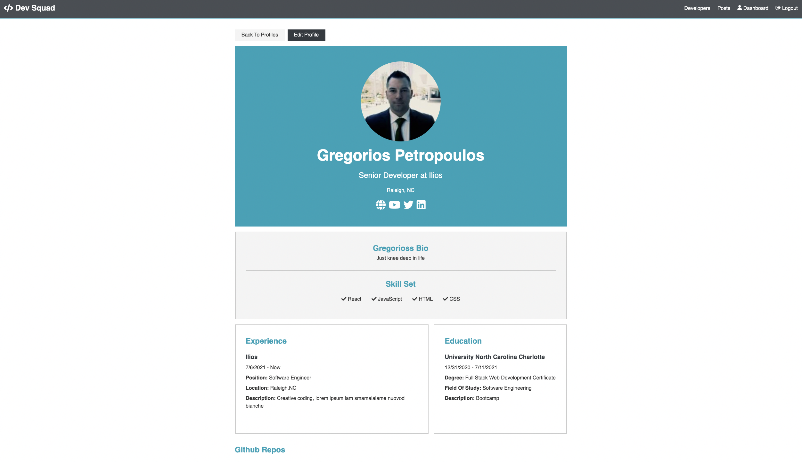
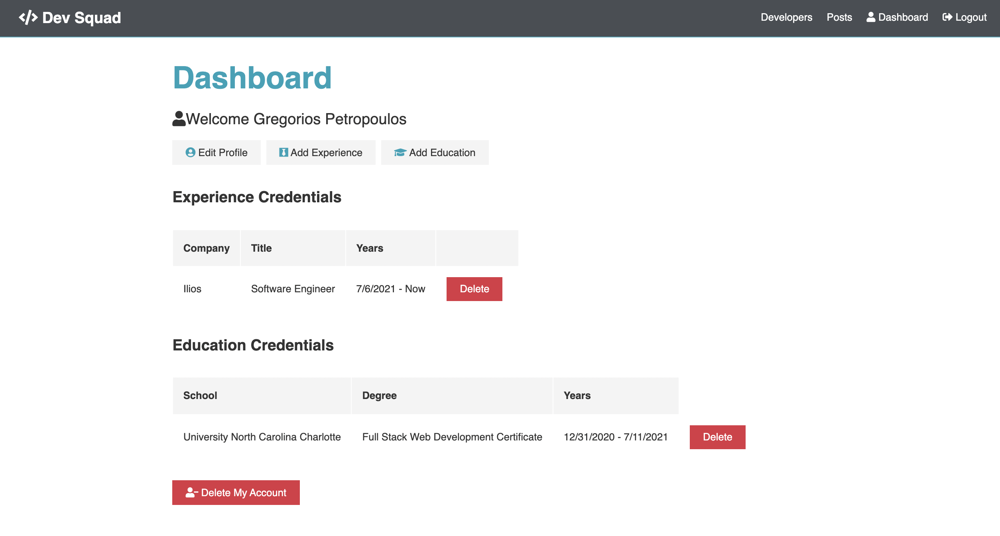
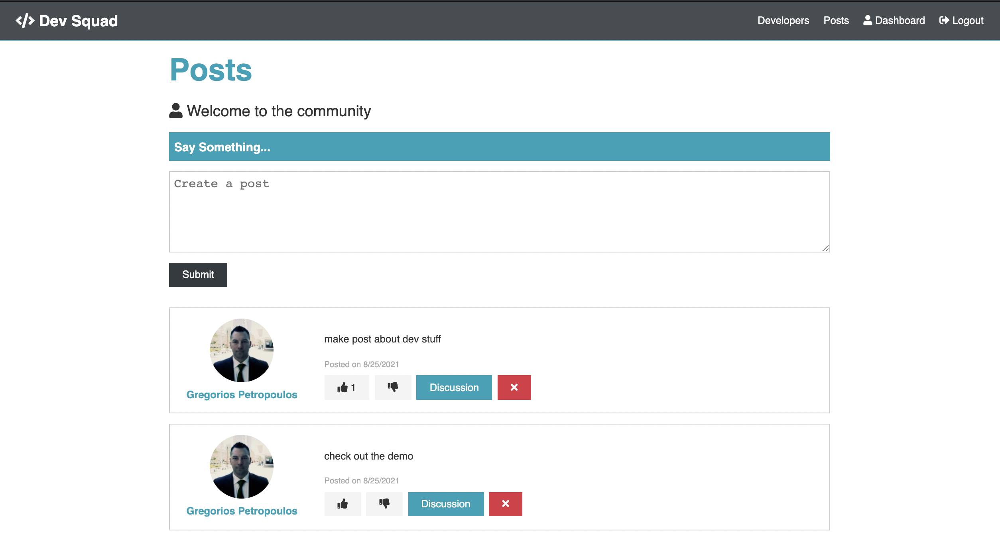
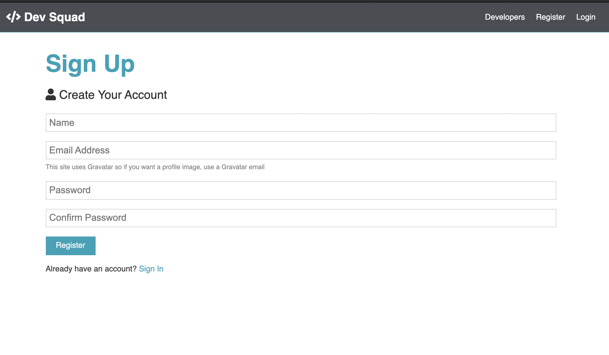

# Dev-Squad

This is a full stack MERN social media app for software developers to connect and exchange ideas. The App is rich in API calls using insomnia, Protected routes and endpoints with JSON Web Tokens, Redux for app state management and testing with Redux Chrome extension, creating actions and reducers for resources, creating a build script, secured keys, and deployed to Heroku with git commands.

[Deployed Link](https://dev-talk-dev.herokuapp.com/)

### Screenshot Demo

Login

Profile

Dashboard

Post

Register

<!-- Table of Contents -->

<!-- 
Credits
https://jwt.io/
https://en.gravatar.com/
https://www.mongodb.com/ -->

